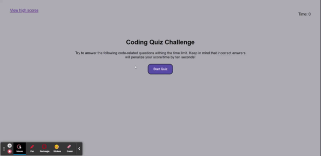

# Coding-Quiz-Challenge

<!-- ABOUT THE PROJECT -->
## About the Project

For the fourth challenge `Code Quiz`, I built this website from scratch. The above gif shows my website's functionality and the different div's appearing after certain criteria have been met. It was challenging and at the beginning it seemed very complicated and too much to do but I was able to work through it one problem at a time. After the start quiz button is pressed, the user is presented with questions and based on how much time is left after the questions are answered, the user is given a score that can be saved to local storage. On the high score screen there are two buttons that restart the quiz and clear the scores.

I found a YouTube video that helped me get started that I linked in the HTML code on line 32, and I used the previous activites quite a bit to get ideas and to understand how to get started, and to come up with ideas on what the next step should be.

<!-- BUILT WITH -->
## Built With
<ul>
    <li> HTML </li>
    <li> CSS </li>
    <li> JavaScript </li>
    <li> Web-APIs </li>
</ul>

<!-- CONTACT ME -->
## Contact

Email: z.d.jorgensen@gmail.com

Link to Challenge: [https://zdjorgensen.github.io/Coding-Quiz/]

(<a href="#top">Back to Top</a>)
